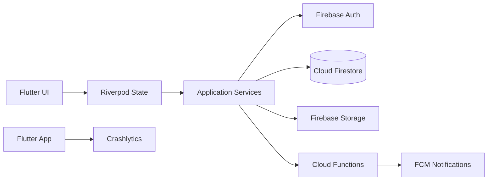

# CoreHives

CoreHives is an internal finance and employee-management platform with a Flutter mobile client, Firebase-backed services, and supporting web/cloud components.

It is designed around operational workflows such as employee management, payroll, transactions, notifications, and internal Android distribution.

## Mobile Stack

- Flutter / Dart
- Riverpod for state management
- GoRouter for navigation
- Firebase Authentication
- Cloud Firestore
- Firebase Storage
- Firebase Cloud Functions
- Firebase Cloud Messaging
- Firebase Crashlytics
- Freezed / JSON serialization

## Main Mobile Modules

- Authentication and session handling
- Employee management
- Payroll workflows
- Transaction management
- Notifications
- User profile
- Application configuration
- Internal dashboard/home experience

## Architecture



## Repository Structure

```text
corehives/
├── mobile/       Flutter mobile application
├── web/          Web application/supporting frontend
├── functions/    Firebase Cloud Functions
├── firebase/     Firebase-related configuration/resources
├── scripts/      Project tooling and scripts
└── update.json   Internal application update metadata
```

## Engineering Focus

CoreHives demonstrates several production-oriented mobile patterns:

- role-aware internal application workflows
- Firebase-backed authentication and data access
- structured state management with Riverpod
- push-notification integration
- server-side Cloud Function workflows
- crash/error visibility with Crashlytics
- internal Android release distribution outside the Play Store
- application update metadata and version-management workflows

## Run the Flutter Application

```bash
cd mobile
flutter pub get
flutter run
```

For a release APK:

```bash
flutter clean
flutter pub get
flutter build apk --release
```

## Internal Distribution

CoreHives includes an internal update flow for distributing Android builds outside the Play Store. See [`UPDATE_SYSTEM.md`](UPDATE_SYSTEM.md) for the repository's update-system notes.

## Security

Do not commit private Firebase service-account credentials, production secrets, signing keys, or environment-specific credentials. Configure sensitive values outside source control.

## License

This repository is publicly visible for portfolio and demonstration purposes. **All Rights Reserved.** The source code may not be copied, modified, redistributed, sold, sublicensed, or incorporated into another project without prior written permission from the copyright owner. See [`LICENSE`](LICENSE).
